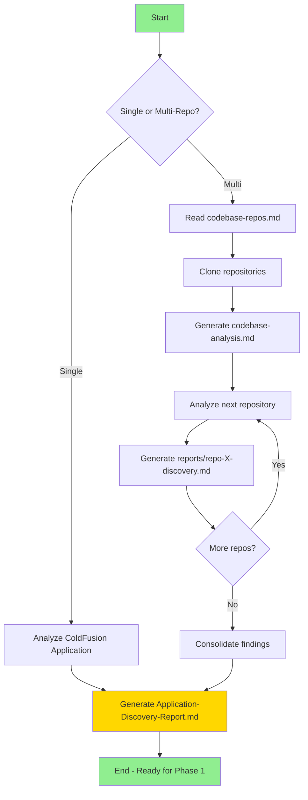
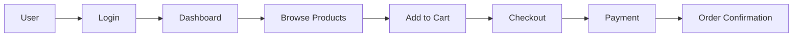

# Phase 0: ColdFusion Application Discovery & Understanding

## Objective

Thoroughly analyze and document ColdFusion (CFML) application(s) to understand **what the application does**, its components, business logic, and behavior. This phase creates the foundation for the migration to Java / Spring Boot.

**Goal**: Before we can migrate, we must fully understand the existing ColdFusion application.

## Context

This prompt works with ColdFusion (CFML) repositories (single or multi-repo). The analysis produces comprehensive documentation about:
- What the application does (features, user journeys)
- How it's structured (components, architecture)
- Business logic location and flow
- All dependencies and integrations

## Workflow



---

## Step 1: ColdFusion Engine & Framework Detection

First, identify what type of ColdFusion application we're dealing with:

### 1.1 Detect the CFML Engine

Use `file_search` and `grep_search` to identify the engine:

| Engine | Detection Pattern |
|--------|------------------|
| **Adobe ColdFusion** | `WEB-INF/cfusion/`, `neo-*.xml` config, `cfide/`, `Adobe` in admin, modern CFML tags + `cfscript` |
| **Lucee** | `WEB-INF/lucee/`, `.lucee` config, `lucee-*.jar`, `Lucee` in admin |
| **Railo / BlueDragon (legacy)** | `WEB-INF/railo/`, `railo-*.xml`, BlueDragon markers, older CFML syntax |
| **CFML version** | Check for `cfscript`-only components, tag-in-script syntax, member functions (e.g., `arr.len()`), null support |

### 1.2 Detect the CFML Framework

| Framework | Detection Pattern |
|-----------|------------------|
| **Vanilla (Application.cfc)** | `Application.cfc` with `onApplicationStart/onRequestStart/onRequest`, no MVC framework |
| **Vanilla (Application.cfm, legacy)** | `Application.cfm` with `<cfapplication>`, page-based flow, no `Application.cfc` |
| **ColdBox** | `box.json` with `coldbox`, `config/Coldbox.cfc`, `handlers/`, `models/`, `views/`, WireBox/CBORM |
| **FW/1 (Framework One)** | `framework.one` refs, `controllers/`, `services/`, `subsystems/`, `variables.framework` in Application.cfc |
| **Fusebox** | `fusebox.xml`, `circuit.xml`, `fbx_*.cfm` files, `fuseaction` params |
| **Mach-II** | `mach-ii.xml`, `listeners/`, `views/`, `event-handlers` |
| **Model-Glue** | `ModelGlue.xml`, `controllers/`, event broadcasts |
| **CFWheels** | `wheels/` folder, `config/settings.cfm`, RESTful routes, `models/` + `controllers/` |
| **Custom / mixed** | No framework markers; `.cfm` pages act as controllers + views, CFCs in `cfcs/` or `com/` |

### 1.3 Detect Application Type

| Type | Indicators |
|------|------------|
| **Web Application** | `.cfm` views, `<cfoutput>`, session scope, forms |
| **REST API** | `<cfcontent type="application/json">`, `serializeJSON()`, Taffy/ColdBox REST, `remote` methods |
| **Admin Panel** | CRUD `.cfm` pages, dashboard views, role checks |
| **E-commerce** | Cart, checkout, products, payment gateways |
| **CMS / portal** | Content management, dynamic pages, SVN/asset browsers |
| **SOAP/Web Service** | `<cfcomponent>` with `access="remote"`, `returnformat="wddx"`, `.cfc?wsdl` |

---

## Step 2: Component Discovery

### 2.1 Request Handlers & Routes

**For vanilla `.cfm` (page-based):**
```
file_search: **/*.cfm
grep_search: "<cfswitch|<cfif structKeyExists\\(url|form"
grep_search: "fuseaction|event=|action="
```

**For ColdBox:**
```
file_search: handlers/**/*.cfc
file_search: config/Router.cfc, config/Coldbox.cfc
```

**For FW/1:**
```
file_search: controllers/**/*.cfc
```

**Document each handler / page:**
| Handler / Page | File Path | Actions/Methods | Route / Fuseaction | Purpose |
|----------------|-----------|-----------------|--------------------|---------|
| UserController.cfc | handlers/User.cfc | index, show, save, delete | /user/* | User CRUD operations |
| users.cfm | users.cfm | list + edit via `<cfswitch>` on `url.action` | ?action=list | User list & edit page |

### 2.2 Components / Models (Data Layer)

**For CF-ORM (`persistent="true"`):**
```
file_search: **/*.cfc
grep_search: "persistent\\s*=\\s*\"true\"|<cfproperty"
grep_search: "fieldtype=\"one-to-many\"|fieldtype=\"many-to-one\""
```

**For DataMgr:**
```
file_search: **/DataMgr/**/*.cfc
grep_search: "createObject\\(\"component\",\\s*\"DataMgr|getRecords\\(|saveRecord\\("
```

**For raw `<cfquery>` data access:**
```
grep_search: "<cfquery|queryExecute\\(|<cfstoredproc"
```

**Document each model / component:**
| Model / CFC | File Path | Table | Relationships | Key Fields | Business Rules |
|-------------|-----------|-------|---------------|------------|----------------|
| User.cfc | cfcs/User.cfc | users | one-to-many(Order), many-to-one(Role) | id, email, password, role_id | Email unique, soft delete flag |

### 2.3 Services & Business Logic

**This is CRITICAL for migration** - identify where business logic lives:

```
file_search: **/*Service.cfc, **/services/**/*.cfc
file_search: **/cfcs/**/*.cfc, **/com/**/*.cfc, models/**/*.cfc
grep_search: "createObject\\(\"component\"|new .+\\(\\)|application\\.[a-zA-Z]+\\s*="
grep_search: "<cffunction|function .+\\("
```

**Note:** In many CFML apps, singleton service CFCs are instantiated in `Application.cfc` (`onApplicationStart`) and stored in the `application` scope (e.g., `application.userService`).

**Document each service:**
| Service | File Path | Responsibility | Dependencies | Key Methods | Business Rules |
|---------|-----------|----------------|--------------|-------------|----------------|
| PaymentService.cfc | cfcs/PaymentService.cfc | Process payments | gatewayCFC, OrderService | processPayment(), refund() | Validate card, check limits |

### 2.4 Views & UI Components

**For `.cfm` views + custom tags:**
```
file_search: **/*.cfm
grep_search: "<cfoutput|<cfif|<cfloop|<cfinclude"
file_search: **/tags/**/*.cfm, **/customtags/**/*.cfm
grep_search: "<cf_|<cfmodule|<cfsavecontent|<cfimport"
```

**For layouts / includes:**
```
grep_search: "<cfinclude template=|layout|header.cfm|footer.cfm"
```

**Document UI structure:**
| View/Template | File Path | Layout / Include | Custom Tags Used | Purpose |
|---------------|-----------|------------------|------------------|---------|
| dashboard.cfm | dashboard.cfm | header.cfm / footer.cfm | `<cf_sidebar>`, `<cf_chart>` | Main user dashboard |

### 2.5 Request Lifecycle & Filters

CFML applications typically implement cross-cutting concerns in `Application.cfc` lifecycle methods (or `Application.cfm` for legacy apps), plus custom tags and interceptors.

```
file_search: **/Application.cfc, **/Application.cfm
grep_search: "onApplicationStart|onSessionStart|onRequestStart|onRequest|onRequestEnd|onError|onMissingTemplate"
grep_search: "<cflogin|<cfloginuser|isUserInRole|<cfapplication"
```

**Document lifecycle / filters:**
| Lifecycle Hook / Filter | File Path | Applied To | Purpose |
|-------------------------|-----------|------------|---------|
| onRequestStart | Application.cfc | All requests | Auth check, request setup |
| onError | Application.cfc | All requests | Global error handling |
| `<cflogin>` block | Application.cfc / login.cfm | Protected pages | Verify user authentication |

### 2.6 Database Schema & Migrations

CFML has no single standard migration tool. Schema may come from hand-written `.sql`, DataMgr auto-schema, or CommandBox `cfmigrations`.

```
file_search: **/*.sql, **/migrations/**/*.cfc
grep_search: "CREATE TABLE|ALTER TABLE"
grep_search: "cfmigrations|migrate up|dbCreateTable|dbCreateColumns"
```

**Document database structure:**
| Table | Source (SQL / DataMgr / cfmigrations) | Columns | Indexes | Foreign Keys |
|-------|---------------------------------------|---------|---------|--------------|
| users | schema.sql | id, email, password, created_at | email (unique) | - |

### 2.7 Background Jobs & Scheduled Tasks

```
grep_search: "<cfschedule|<cfthread|createObject\\(\"java\",\\s*\"java.lang.Thread"
grep_search: "scheduledtasks|neo-cron|cronjob"
file_search: **/scheduled/**/*.cfm, **/tasks/**/*.cfm
```

**Document jobs:**
| Job / Task | File Path | Trigger | Purpose | Schedule |
|------------|-----------|---------|---------|----------|
| sendEmails.cfm | tasks/sendEmails.cfm | `<cfschedule>` / CF Admin | Send transactional emails | On-demand |
| cleanup.cfm | tasks/cleanup.cfm | CF Admin scheduled task | Remove old records | Daily 2am |

### 2.8 Dependencies & Built-in Tags

CFML dependencies come from built-in tags/functions, `createObject("java",...)` interop (often via JavaLoader), CommandBox/ForgeBox modules (`box.json`), and bundled `.jar`/CFC libraries.

```
read_file: box.json (if CommandBox/ForgeBox is used)
file_search: **/*.jar, **/javaloader/**, **/lib/**
grep_search: "<cfmail|<cffile|<cfhttp|<cfdocument|<cfpdf|<cfspreadsheet|<cfimage|<cfftp|<cfldap"
grep_search: "createObject\\(\"java\"|JavaLoader"
```

**Document key dependencies:**
| Dependency (tag / module / jar) | Purpose | Java Equivalent |
|---------------------------------|---------|-----------------|
| `<cfmail>` | Send email | Spring `JavaMailSender` |
| `<cfdocument>` / `<cfpdf>` | PDF generation | OpenPDF / iText |
| `<cfspreadsheet>` | Excel files | Apache POI |
| `<cfhttp>` | HTTP calls | `HttpClient` / `WebClient` |
| `createObject("java","...")` / JavaLoader | Java interop | Native Java (already on JVM) |

---

## Step 3: Business Logic Analysis

### 3.1 Feature Inventory

Create a complete list of what the application does:

**User-Facing Features:**
| Feature | Description | Components Involved | Priority |
|---------|-------------|---------------------|----------|
| User Registration | New users can sign up | register.cfm, User.cfc, UserService.cfc | High |
| Product Search | Search products by name/category | search.cfm, SearchService.cfc | High |

**Admin Features:**
| Feature | Description | Components Involved | Priority |
|---------|-------------|---------------------|----------|
| User Management | CRUD for users | admin/users.cfm, UserService.cfc | Medium |

### 3.2 User Journeys

Document the main user flows:



### 3.3 Business Rules Location

**CRITICAL**: Document where each business rule is implemented:

| Business Rule | Description | File Location | Function |
|---------------|-------------|---------------|----------|
| Order minimum | Orders must be > $10 | cfcs/OrderService.cfc | validateOrder() |
| Password policy | Min 8 chars, 1 number | cfcs/UserService.cfc | validatePassword() |
| Discount logic | 10% off orders > $100 | cfcs/DiscountService.cfc | calculateDiscount() |

---

## Step 4: Integration & Dependencies

### 4.1 External APIs

```
grep_search: "<cfhttp|createObject\\(\"java\",\\s*\"java.net|WebService|<cfinvoke webservice"
```

**Document external integrations:**
| API | Purpose | Endpoint Pattern | Auth Method | Used In |
|-----|---------|-----------------|-------------|---------|
| Stripe | Payments | api.stripe.com | API Key | PaymentService.cfc |
| SendGrid | Email | api.sendgrid.com | API Key | EmailService.cfc |

### 4.2 Database Connections

```
grep_search: "<cfquery datasource=|queryExecute\\(.+datasource|this.datasource"
read_file: Application.cfc / settings.ini.cfm (datasource config) or CF Administrator datasources
```

**Document database usage:**
| Database | Type | Purpose | Datasource Name |
|----------|------|---------|-----------------|
| Main DB | MySQL 8.0 | Application data | myAppDSN |
| Cache | Redis / `<cfcache>` | Session & cache | - |

**Note:** The datasource is typically defined in the CF Administrator, in `Application.cfc` (`this.datasources`), or in a config file such as `settings.ini.cfm`.

### 4.3 File Storage

```
grep_search: "<cffile|<cfdirectory|fileWrite\\(|fileRead\\(|expandPath\\("
```

### 4.4 Threads / Async Processing

```
grep_search: "<cfthread|thread action=|<cfschedule"
grep_search: "createObject\\(\"java\",\\s*\"java.util.concurrent"
```

---

## Step 5: Configuration & Environment

### 5.1 Configuration Sources

CFML apps configure themselves via `Application.cfc` (`this.*` settings), config files (`settings.ini.cfm`, `settings.local.cfm`), and the CF Administrator.

```
read_file: Application.cfc, config/settings.ini.cfm, config/settings.local.cfm
grep_search: "this\\.|application\\.settings|getProfileString\\(|<cfconfig"
```

**Document all configuration values:**
| Setting | Purpose | Required | Default | Sensitive |
|---------|---------|----------|---------|-----------|
| datasource | Database datasource name | Yes | - | No |
| mailServer | SMTP host | Yes | localhost | No |
| stripeSecret | Stripe API key | Yes | - | Yes |

### 5.2 Configuration Files

| Config File | Purpose | Key Settings |
|-------------|---------|--------------|
| Application.cfc | App settings & lifecycle | this.name, this.datasource, this.sessionManagement, mappings |
| settings.ini.cfm | Environment settings | datasource, mail, API keys |
| CF Administrator | Server-level config | datasources, scheduled tasks, mappings, JVM args |

---

## Step 6: Generate Discovery Report

Create `reports/Application-Discovery-Report.md` with the following structure:

```markdown
# Application Discovery Report

**Application Name**: [Name]
**Analysis Date**: [Date]
**CFML Engine**: [Adobe ColdFusion / Lucee / Railo — version]
**Framework**: [Framework + Version, or vanilla Application.cfc/.cfm]
**Application Type**: [Web App/API/Admin Panel/etc.]

## Executive Summary

[2-3 paragraphs describing what this application does, who uses it, and its core purpose]

## Application Architecture

### Architecture Diagram

[Mermaid diagram showing components and their relationships]

### Technology Stack

| Layer | Technology |
|-------|------------|
| Frontend | .cfm + `<cfoutput>` / custom tags + Bootstrap |
| Backend | Adobe ColdFusion 2021 / Lucee 5 (CFML) |
| Database | MySQL 8.0 |
| Cache | Redis / `<cfcache>` |
| Async | `<cfthread>` / `<cfschedule>` |

## Component Inventory

### Handlers / Pages ([Count])
[Table of all request handlers and .cfm pages]

### Models / Components ([Count])
[Table of all models/CFCs with relationships]

### Services ([Count])
[Table of all services with business logic]

### Views ([Count])
[Table of all views/.cfm templates]

> This page/view list and the User Journeys below seed the **visual baseline** capture in Phase 2
> (a screenshot of each page). Note which pages need a record id/param or a specific role to render.

### Lifecycle & Filters ([Count])
[Table of Application.cfc hooks and cross-cutting logic]

### Jobs & Scheduled Tasks ([Count])
[Table of background processes]

## Feature Inventory

### User Features
[Complete list with components]

### Admin Features
[Complete list with components]

## Business Logic Map

[Table mapping business rules to files and functions]

## External Integrations

[Table of all external APIs and services]

## Database Schema

### Entity Relationship Diagram

[Mermaid ER diagram]

### Tables Summary
[Table list with key columns and relationships]

## Environment & Configuration

[Configuration sources and settings]

## Complexity Assessment

| Area | Complexity | Notes |
|------|------------|-------|
| Handlers / Pages | Medium | 15 .cfm pages, standard CRUD |
| Business Logic | High | Complex discount and pricing rules |
| UI | Medium | 45 .cfm templates + custom tags |
| Integrations | Low | 2 external APIs |

## Ready for Phase 1

This application is now documented and ready for technical assessment.

**Next Step**: Run `/phase1-technicalassessment` to gather migration preferences and create the technical assessment report.
```

---

## Multi-Repository Support

For solutions with multiple repositories, repeat the analysis for each repo and create:

1. Individual reports: `reports/[repo-name]-discovery.md`
2. Consolidated summary: `reports/Application-Discovery-Summary.md`

### Multi-Repo Workflow

1. **Read `codebase-repos.md`** with repository URLs
2. **Clone all repositories** to `repos/` folder
3. **Create `codebase-analysis.md`** as task tracker
4. **Analyze ONE repository at a time** (avoid context overflow)
5. **Generate individual discovery report** for each
6. **Consolidate** into summary with cross-repo dependencies

---

## Rules & Constraints

### Analysis Rules
- Analyze **ONE repository at a time** to avoid context overflow
- Read **2000 lines at a time** for sufficient context
- Use `semantic_search` for cross-file pattern discovery
- Document **ALL components** - don't skip any
- Watch for **mixed tag + `<cfscript>`** styles within the same CFC/page

### Documentation Rules
- Create reports in `reports/` folder
- Use Mermaid diagrams for visualizations
- Make reports human-readable with clear formatting
- Include file paths for all documented components

### Business Logic Priority
- **CRITICAL**: Identify all business logic locations
- Document business rules with file paths and function/method names
- This information is essential for Phase 2 (Migration Planning)

### Do NOT
- Do NOT start migration planning in this phase
- Do NOT assess technical risks yet (Phase 1)
- Do NOT make recommendations yet
- Focus ONLY on understanding and documenting

---

## Deliverables

At the end of Phase 0, you should have:

1. ✅ `reports/Application-Discovery-Report.md` - Complete application understanding
2. ✅ All components documented with file paths
3. ✅ Business logic mapped to specific files and functions
4. ✅ Feature inventory with component relationships
5. ✅ Architecture diagrams (Mermaid)
6. ✅ Database schema documented

**Next Step**: Proceed to `/phase1-technicalassessment` to gather user preferences and create the technical assessment.
