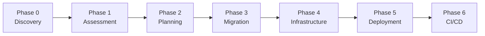

# GitHub Copilot Framework - ColdFusion to Java 21 Migration

## Document Summary

See the full [*Document Summary*](DocumentSummary.md).

## Change Log

See the full [*Change Log*](ChangeLog.md)

## Contents

- [GitHub Copilot Framework - ColdFusion to Java 21 Migration](#github-copilot-framework---coldfusion-to-java-21-migration)
  - [Document Summary](#document-summary)
  - [Change Log](#change-log)
  - [Contents](#contents)
  - [1. Introduction](#1-introduction)
    - [Purpose of this Document](#purpose-of-this-document)
    - [Target Audience](#target-audience)
  - [Copilot Migration Agent Overview](#copilot-migration-agent-overview)
    - [Core Capabilities](#core-capabilities)
  - [Migration \& Modernization Process](#migration--modernization-process)
    - [Phase 0: Application Discovery](#phase-0-application-discovery)
    - [Phase 1: Technical Assessment](#phase-1-technical-assessment)
    - [Phase 2: Migration Planning](#phase-2-migration-planning)
    - [Phase 3: Code Migration](#phase-3-code-migration)
    - [Phase 4: Infrastructure Generation](#phase-4-infrastructure-generation)
    - [Phase 5: Deployment to Azure](#phase-5-deployment-to-azure)
    - [Phase 6: CI/CD Pipeline Setup](#phase-6-cicd-pipeline-setup)
  - [Key Features](#key-features)
  - [Tool Setup Guide](#tool-setup-guide)
    - [Requirements](#requirements)
    - [Azure Requirements](#azure-requirements)
    - [Installing Extensions](#installing-extensions)
    - [Sign in to use copilot](#sign-in-to-use-copilot)
  - [Repository Structure](#repository-structure)
  - [Skills Reference](#skills-reference)
    - [coldfusion-to-java-mapping](#coldfusion-to-java-mapping)
    - [jpa-hibernate-migration](#jpa-hibernate-migration)
    - [spring-boot-project-structure](#spring-boot-project-structure)
    - [azure-containerization](#azure-containerization)
  - [Guidelines for Migration with Sample Application](#guidelines-for-migration-with-sample-application)
    - [Running the Sample Application Locally (Docker)](#running-the-sample-application-locally-docker)
    - [Phase 0: Application Discovery](#phase-0-application-discovery-1)
    - [Phase 1: Technical Assessment](#phase-1-technical-assessment-1)
    - [Phase 2: Migration Planning](#phase-2-migration-planning-1)
    - [Phase 3: Code Migration](#phase-3-code-migration-1)
    - [Phase 4: Infrastructure Generation](#phase-4-infrastructure-generation-1)
    - [Phase 5: Deploy To Azure](#phase-5-deploy-to-azure)
    - [Phase 6: CI/CD Pipeline Setup](#phase-6-cicd-pipeline-setup-1)
  - [Testing the Migrated Application](#testing-the-migrated-application)
    - [Avoiding Hallucinations](#avoiding-hallucinations)
  - [References](#references)

---

## 1. Introduction

This runbook provides comprehensive guidance for migrating ColdFusion (CFML) applications to Java 21 / Spring Boot 3.x for Azure deployment. It leverages GitHub Copilot's AI capabilities through custom agents, prompts, and skills to streamline and accelerate the migration process.

### Purpose of this Document

- Serve as a step-by-step guide for ColdFusion to Java 21 / Spring Boot migration
- Document optimal practices for using GitHub Copilot agents in application migrations
- Provide troubleshooting and validation guidance for each migration phase
- Establish a framework for modernizing ColdFusion applications to Java 21 on Azure

### Target Audience

- Development Teams migrating ColdFusion (CFML) applications
- Customers/Partners/Developers working with ColdFusion and Java

---

## Copilot Migration Agent Overview

The ColdFusion to Java 21 Migration Agent is an AI-assisted tool that leverages GitHub Copilot's capabilities specifically for migrating ColdFusion (CFML) applications to modern Java 21 / Spring Boot 3.x applications running on Azure. It combines conversational AI with technical expertise through:

- **Custom Agent**: `.github/agents/Code-Migration-Modernization.agent.md`
- **Phase Prompts**: `.github/prompts/` (7 migration phases)
- **Skills**: `.github/skills/` (mapping references and templates)

### Core Capabilities

1. **CFML Engine & Framework Detection**: Identifies the engine (Adobe ColdFusion, Lucee, Railo/BlueDragon) and framework (vanilla `Application.cfc`/`Application.cfm`, ColdBox, FW/1, Fusebox, Mach-II, Model-Glue, CFWheels)
2. **Automated Code Transformation**: Converts CFML patterns to Java 21 / Spring Boot equivalents
3. **ORM Migration**: Transforms CF-ORM / DataMgr / `<cfquery>` to JPA / Hibernate
4. **Template Conversion**: Migrates `.cfm` / `<cfoutput>` / custom tags to Thymeleaf templates
5. **Infrastructure as Code Generation**: Creates Bicep/Terraform templates for Azure resources
6. **CI/CD Pipeline Creation**: Generates GitHub Actions and Azure DevOps pipelines
7. **Documentation Automation**: Creates and maintains migration status reports
8. **Interactive Problem-Solving**: Provides conversational guidance for issue resolution

---

## Migration & Modernization Process

The repository implements a structured 7-phase approach to ColdFusion to Java 21 migration:



### Phase 0: Application Discovery

Analyze the ColdFusion application to understand its components, business logic, and architecture. This phase creates the foundation for migration by documenting:

- CFML engine and framework detection
- Handlers/pages, components (CFCs), services, and views inventory
- Business logic locations and flows
- Dependencies and integrations

**Prompt**: `/phase0-applicationdiscovery`

### Phase 1: Technical Assessment

Assess migration risks and gather user preferences for the Java / Spring Boot architecture:

- Evaluate migration complexity and risks
- Map CFML patterns to Java equivalents
- Gather preferences (Spring Boot MVC vs REST API, JPA/Hibernate vs JDBC, etc.)
- Estimate migration effort

**Prompt**: `/phase1-technicalassessment`

### Phase 2: Migration Planning

Create a detailed file-by-file migration plan:

- Document method-level mappings for services
- Define migration order by waves (dependencies first)
- Track business rules from source to target locations
- Generate `reports/Migration-Plan-Detailed.md`

**Prompt**: `/phase2-createmigrationplan`

### Phase 3: Code Migration

Execute the ColdFusion to Java 21 migration following the plan:

- Create Java 21 / Spring Boot project structure
- Migrate handlers/pages, services, and business logic
- Convert CF-ORM / DataMgr / `<cfquery>` to JPA / Hibernate entities
- Transform `.cfm` / custom tags to Thymeleaf templates
- Validate with builds after each wave

**Prompt**: `/phase3-migratecode`

### Phase 4: Infrastructure Generation

Generate Azure infrastructure as code:

- Create Bicep or Terraform files
- Configure Azure hosting (App Service, Container Apps, AKS)
- Set up monitoring, security, and networking
- Include Application Insights and health checks

**Prompt**: `/phase4-generateinfra`

### Phase 5: Deployment to Azure

Deploy the Java 21 application to Azure:

- Use Azure Developer CLI (azd) for deployment
- Validate health and functionality
- Configure managed identities and Key Vault

**Prompt**: `/phase5-deploytoazure`

### Phase 6: CI/CD Pipeline Setup

Configure automated deployment pipelines:

- Set up GitHub Actions or Azure DevOps pipelines
- Include quality gates and security scanning
- Configure environment separation (dev/staging/prod)

**Prompt**: `/phase6-setupcicd`

---

## Key Features

- **CFML Engine & Framework Support**: Adobe ColdFusion, Lucee, Railo/BlueDragon; vanilla `Application.cfc`/`Application.cfm`, ColdBox, FW/1, Fusebox, Mach-II, Model-Glue, CFWheels
- **ORM Migration**: CF-ORM / DataMgr / `<cfquery>` to JPA / Hibernate with relationships
- **Template Conversion**: `.cfm` / `<cfoutput>` / custom tags to Thymeleaf templates
- **Dependency Mapping**: CFML built-in tags, Java interop, and modules to Maven/Gradle equivalents
- **Authentication Migration**: `<cflogin>` / `<cfloginuser>` / `isUserInRole()` to Spring Security / Entra ID
- **Containerization**: Docker support with multi-stage builds for Azure deployment
- **Multiple Azure Targets**: App Service, Container Apps, AKS
- **Status Tracking**: Comprehensive migration progress reporting via `/getstatus`

---

## Tool Setup Guide

### Requirements

- GitHub Copilot License (Enterprise recommended)
- Visual Studio Code 1.101+ [Download](https://code.visualstudio.com/updates/v1_101)
- GitHub Copilot Extension 1.35+ [Download](https://marketplace.visualstudio.com/items?itemName=GitHub.copilot)
- GitHub Copilot Chat Extension 0.30+ [Download](https://marketplace.visualstudio.com/items?itemName=GitHub.copilot-chat)
- Azure MCP Server Extension [Download](https://marketplace.visualstudio.com/items?itemName=ms-azuretools.vscode-azure-mcp-server)
- GitHub Copilot for Azure Extension [Download](https://marketplace.visualstudio.com/items?itemName=ms-azuretools.vscode-azure-github-copilot)
- AZD CLI [Download](https://learn.microsoft.com/en-us/azure/developer/azure-developer-cli/install-azd)
- AZ CLI [Download](https://learn.microsoft.com/en-us/cli/azure/install-azure-cli-windows)
- JDK 21 (Eclipse Temurin recommended) [Download](https://adoptium.net/temurin/releases/?version=21)
- Docker Desktop (for containerization) [Download](https://www.docker.com/products/docker-desktop)

### Azure Requirements

- Azure subscription (Contributor / User Access Administrator role)
- Entra ID access for app registration (Application Administrator role)

### Installing Extensions

1. In Visual Studio Code, open the Extensions view from the Activity Bar
2. Search for and install the required extensions listed above
3. After installation, you should see confirmation notifications

### Sign in to use copilot

1. To use GitHub Copilot, sign in to your GitHub account in Visual Studio Code
2. The GitHub Copilot pane can be accessed by clicking the icon at the top of VS Code
3. For more information, refer to [Set up GitHub Copilot in VS Code](https://code.visualstudio.com/docs/copilot/setup)

---

## Repository Structure

```
.github/
├── agents/
│   └── Code-Migration-Modernization.agent.md    # Main migration agent
├── prompts/
│   ├── GetStatus.prompt.md                      # Check migration status
│   ├── Phase0-ApplicationDiscovery.prompt.md   # Discover ColdFusion application
│   ├── Phase1-TechnicalAssessment.prompt.md    # Assess migration risks
│   ├── Phase2-CreateMigrationPlan.prompt.md    # Create file-by-file plan
│   ├── Phase3-MigrateCode.prompt.md            # Execute migration
│   ├── Phase4-GenerateInfra.prompt.md          # Generate Azure IaC
│   ├── Phase5-DeployToAzure.prompt.md          # Deploy to Azure
│   └── Phase6-SetupCICD.prompt.md              # Configure CI/CD
└── skills/
    ├── azure-containerization/                  # Docker & Azure container deployment
    ├── jpa-hibernate-migration/                 # CF-ORM/DataMgr/<cfquery> to JPA/Hibernate patterns
    ├── coldfusion-to-java-mapping/              # ColdFusion to Java mapping reference
    └── spring-boot-project-structure/           # Spring Boot project templates
Sample/                                          # Sample app + local run environment
├── Docker/                                      # Local Docker environment to run the legacy app as-is
│   ├── docker-compose.yml                      # Lucee 5 (app) + MySQL 5.7 (db) services
│   ├── cfconfig/CFConfig.json                  # "project" datasource imported into Lucee
│   ├── config-overrides/                       # settings overrides (empty mapping + local rootURL)
│   ├── images/                                 # Screenshots for the Docker README
│   └── README.md                               # How to run the sample app locally
└── ProjectTrackerSrc/                           # Legacy ColdFusion (CFML) application source
    ├── Application.cfm                          # Legacy application bootstrap (<cfapplication>)
    ├── cfcs/                                    # Business components (CFCs) + DataMgr ORM
    ├── config/                                  # settings.cfc / settings.ini.cfm / settings.local.cfm
    ├── tags/                                    # Custom CFML tags
    ├── templates/                               # Shared .cfm view templates
    ├── includes/                                # Shared includes / UDFs
    ├── api/                                     # API interface
    ├── mobile/                                  # Mobile interface
    └── *.cfm                                    # Root .cfm pages (controllers + views)
```

---

## Skills Reference

The migration agent uses specialized skills that provide mapping references and templates:

### coldfusion-to-java-mapping

ColdFusion to Java 21 code mapping reference including:

- Framework mapping (vanilla CFML / ColdBox / FW/1 → Spring Boot MVC)
- Template syntax (`.cfm` / `<cfoutput>` / custom tags → Thymeleaf)
- Dependency mapping (CFML built-in tags / Java interop / modules → Maven/Gradle)
- Authentication patterns (`<cflogin>` → Spring Security)

### jpa-hibernate-migration

JPA / Hibernate migration patterns:

- CF-ORM persistent CFCs / DataMgr models → JPA entities
- Relationship mapping (`fieldtype="one-to-many"`, `"many-to-one"`, `"many-to-many"`)
- Soft deletes and timestamps
- CFC finder methods / `<cfquery>` → Spring Data JPA Specifications

### spring-boot-project-structure

Spring Boot 3.x project structure templates:

- Spring Boot MVC (from vanilla CFML / ColdBox / FW/1)
- Spring Boot REST (from Taffy / remote `.cfc` methods)
- Folder organization and naming conventions

### azure-containerization

Docker and Azure deployment best practices:

- Multi-stage Dockerfile templates
- docker-compose for local development
- Azure Container Apps configuration
- Health checks and security

---

## Guidelines for Migration with Sample Application

The repository includes a sample ColdFusion (CFML) application under `Sample/ProjectTrackerSrc/` demonstrating the migration process, with a ready-to-run local environment under `Sample/Docker/`. It is a project-management / issue-tracking and collaboration app.

**Sample Application Overview**:

- **Source**: Legacy CFML using `Application.cfm` (`<cfapplication>` with session-based login) — a mix of CFML tags and `<cfscript>`
- **Structure**: Root `.cfm` pages act as controllers + views (`index.cfm`, `project.cfm`, `issues.cfm`, `milestones.cfm`, `todos.cfm`, `time.cfm`, `billing.cfm`, `invoice.cfm`, `messages.cfm`, `files.cfm`, …); business logic lives in CFCs under `cfcs/` (e.g. `project.cfc`, `issue.cfc`, `milestone.cfc`, `todo.cfc`, `timetrack.cfc`, `billing.cfc`, `user.cfc`), instantiated in the `application` scope
- **Features**: Projects, milestones, issues/tickets, to‑do lists, time tracking, billing & invoices (PDF), messages, file management, search, RSS, an SVN repository browser, plus `api/` and `mobile/` interfaces
- **Data Access**: `DataMgr` ORM (`cfcs/DataMgr/`) plus `<cfquery>`; Java interop via `JavaLoader.cfc` / `JavaProxy.cfc`
- **Configuration**: `config/settings.cfc` reading `settings.ini.cfm` / `settings.local.cfm` (per-server)
- **Database**: MySQL

### Running the Sample Application Locally (Docker)

Before (or alongside) the migration, you can run the legacy ColdFusion app *as-is* to explore its behavior. A self-contained Docker environment lives under [`Sample/Docker/`](Sample/Docker/) and starts two services: the CFML engine (**Lucee 5** via CommandBox) and the database (**MySQL 5.7**, seeded automatically from the app's shipped schema). The app source lives separately under [`Sample/ProjectTrackerSrc/`](Sample/ProjectTrackerSrc/) and is bind-mounted — no application source code is modified; environment-specific config is supplied via mounted overrides.

**Prerequisites**: Docker Desktop (or Docker Engine + Compose v2).

**Start it**:

```powershell
cd Sample/Docker
docker compose up -d
```

The first run pulls images and seeds the database (~1–3 min). Then open <http://localhost:8080> and log in with a seeded account:

| Username | Password | Role            |
| -------- | -------- | --------------- |
| `admin`  | `admin`  | Administrator   |
| `guest`  | `guest`  | Read-only guest |

**Watch logs / stop it**:

```powershell
docker compose logs -f app     # Lucee startup + request logs (wait for "Server is up")
docker compose down            # stop & remove containers (keeps the DB volume)
docker compose down -v         # also delete the DB volume (full reset / re-seed)
```

See [`Sample/Docker/README.md`](Sample/Docker/README.md) for how it works, the datasource/config overrides, database access on `localhost:3307`, and known limitations.

### Phase 0: Application Discovery

**Prompt**: Enter the following in the chat window:

```text
/phase0-applicationdiscovery - Analyze the ColdFusion application under Sample/ProjectTrackerSrc/
```

The agent will:

1. Detect the CFML engine and framework (legacy `Application.cfm`-style app in this case)
2. Inventory all `.cfm` pages and CFCs and their purposes
3. Map business logic and database operations
4. Generate `reports/Application-Discovery-Report.md`

### Phase 1: Technical Assessment

**Prompt**:

```text
/phase1-technicalassessment
```

Provide your preferences when asked:

- **Architecture**: Spring Boot MVC or REST API
- **Data Access**: JPA / Hibernate or Spring JDBC
- **Authentication**: Spring Security or Entra ID
- **Azure Hosting**: App Service, Container Apps, or AKS
- **IaC Tool**: Bicep or Terraform
- **Database**: Azure SQL, MySQL Flexible Server, or PostgreSQL

### Phase 2: Migration Planning

**Prompt**:

```text
/phase2-createmigrationplan
```

The agent will create a detailed file-by-file migration plan with:

- Source file → Target file mapping
- Method-level mappings for complex logic
- Migration order by waves
- Business rules tracking

### Phase 3: Code Migration

**Prompt**:

```text
/phase3-migratecode
```

The agent will:

1. Create Java 21 / Spring Boot project structure
2. Migrate handlers/pages and services
3. Convert database access to JPA / Hibernate
4. Transform views to Thymeleaf
5. Build and validate after each wave

### Phase 4: Infrastructure Generation

**Prompt**:

```text
/phase4-generateinfra
```

Generates:

- Bicep or Terraform files in `infra/` folder
- Azure resource configurations
- Application Insights monitoring
- Security configurations

### Phase 5: Deploy To Azure

**Prompt**:

```text
/phase5-deploytoazure
```

Deploys using Azure Developer CLI (azd) with:

- Environment provisioning
- Application deployment
- Health validation

### Phase 6: CI/CD Pipeline Setup

**Prompt**:

```text
/phase6-setupcicd
```

Creates:

- GitHub Actions workflows in `.github/workflows/`
- Or Azure DevOps pipelines
- Quality gates and security scanning

---

## Testing the Migrated Application

1. After completing migration, build and run the Java 21 application locally
2. Test all functionality against the original ColdFusion application behavior
3. Use the **@terminal** command to ask the agent for help with debugging
4. Run any existing tests and validate all business rules

### Avoiding Hallucinations

The guided prompts use status files in `reports/`:

- `reports/Report-Status.md` — migration status dashboard
- `reports/Application-Discovery-Report.md` — Phase 0 output
- `reports/Technical-Assessment-Report.md` — Phase 1 output
- `reports/Migration-Plan-Detailed.md` — Phase 2 output

> **Pro tip**: Use `/getstatus` at any time to check migration progress

> **Pro tip 2**: Use the **@terminal** command to debug issues

> **Pro tip 3**: Always verify business logic is preserved after migration

---

## References

- [Visual Studio Code](https://code.visualstudio.com)
- [GitHub Copilot](https://github.com/features/copilot)
- [GitHub Copilot Extension for VS Code](https://marketplace.visualstudio.com/items?itemName=GitHub.copilot)
- [Set up GitHub Copilot in VS Code](https://code.visualstudio.com/docs/copilot/setup)
- [Java 21 Documentation](https://docs.oracle.com/en/java/javase/21/)
- [Spring Boot Documentation](https://docs.spring.io/spring-boot/docs/current/reference/html/)
- [Spring Data JPA](https://docs.spring.io/spring-data/jpa/docs/current/reference/html/)
- [Azure Developer CLI (azd)](https://learn.microsoft.com/azure/developer/azure-developer-cli)
- [Azure Container Apps](https://learn.microsoft.com/azure/container-apps)
- [Azure App Service](https://learn.microsoft.com/azure/app-service)
