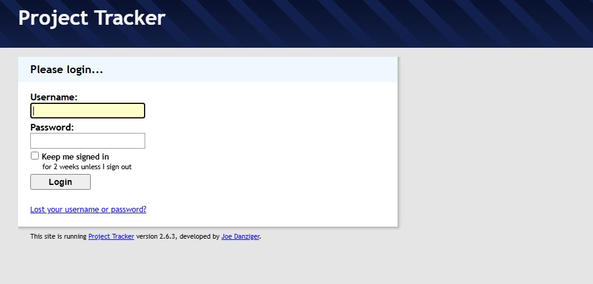

# Run the legacy ColdFusion app (Project Tracker) locally with Docker

This folder contains a self-contained local environment for the CFML application
in the sibling [`ProjectTrackerSrc`](../ProjectTrackerSrc) tree — **Project
Tracker v2.6.3** by Joe Danziger, an open-source project-management /
issue-tracking app originally written for
**ColdFusion 8 / Railo / BlueDragon** with a **MySQL** database.

It is provided so you can run and explore the legacy app *as-is* (for reference
during the ColdFusion → Java migration). **No application source code is
modified** — environment-specific configuration is supplied via mounted
overrides.

---

## What's inside

| File | Purpose |
|------|---------|
| `docker-compose.yml` | Defines two services: `db` (MySQL 5.7) and `app` (Lucee 5 via CommandBox). |
| `cfconfig/CFConfig.json` | Declares the `project` datasource that the app expects, pointing at the `db` service. Imported into Lucee on startup. |
| `config-overrides/settings.ini.cfm` | Local settings used when the app is reached at `http://localhost:8080`. |
| `config-overrides/settings.local.cfm` | Local settings used when the app is reached at `http://127.0.0.1:8080`. |
| `images/` | Screenshots used by this README. |

### Engine & database choices

* **Lucee 5** is used as the CFML engine. It is the free, open-source successor
  to **Railo**, which this app already detects and supports. It runs the legacy
  `Application.cfm` / `<cflogin>` / `<cfquery>` / custom-tag code without a
  license. (Adobe ColdFusion would also work but requires licensing.)
* **MySQL 5.7** is used because the app ships a MySQL schema
  (`Sample/ProjectTrackerSrc/install/db_schemas/mysql.sql`) and uses
  `dsn=project` / `pt_` table prefix. MySQL **5.7** (not 8) is required because
  Lucee 5 bundles the legacy MySQL Connector/J 5.1 driver, which fails against
  MySQL 8 (it queries the `query_cache_size` server variable that MySQL 8
  removed). 5.7 is also period-appropriate for this 2011-era app. The database
  is seeded automatically on first boot.

---

## Prerequisites

* Docker Desktop (or Docker Engine + Compose v2). Verify with:
  ```powershell
  docker --version
  docker compose version
  ```

## Start it

```powershell
cd Sample/Docker
docker compose up -d
```

The first run pulls the images and seeds the database (~1–3 min). Then open:

* **http://localhost:8080**



Log in with one of the seeded accounts:

| Username | Password | Role |
|----------|----------|------|
| `admin`  | `admin`  | Administrator |
| `guest`  | `guest`  | Read-only guest |

## Watch logs / status

```powershell
docker compose ps
docker compose logs -f app     # CFML engine (Lucee) startup + request logs
docker compose logs -f db      # MySQL
```

The Lucee server takes ~30–60 s to finish starting after the container is up.
Wait for `Server is up` in the `app` logs before hitting the URL.

## Stop it

```powershell
docker compose down            # stop & remove containers (keeps the DB volume)
docker compose down -v         # also delete the DB volume (full reset / re-seed)
```

---

## How it works (config, without touching the source)

`Sample/ProjectTrackerSrc/Application.cfm` loads settings from
`config/settings.ini.cfm` (or `config/settings.local.cfm` when the host is
`127.0.0.1`) and connects to a ColdFusion datasource named **`project`**.

* The **datasource** does not exist inside a fresh Lucee, so
  `cfconfig/CFConfig.json` defines it (host `db`, database `project`,
  user/password `project`) and Lucee imports it at startup via the
  `BOX_SERVER_CFCONFIGFILE` environment variable.
* The shipped config assumes the app is deployed under a `/project` path
  mapping. Here the app is served at the **web root**, so the mounted overrides
  set `mapping=` (empty) and `rootURL=http://localhost:8080`. This makes both
  the server-side includes (`<cfmodule template="#mapping#/tags/layout.cfm">`)
  and the browser asset URLs (`#mapping#/js/…`, `#mapping#/css/…`) resolve
  correctly at `/`.
* The override files are **bind-mounted on top of** the shipped ones, so
  `Sample/ProjectTrackerSrc/config/*.cfm` is never changed on disk.

## Database

* Seeded once from `Sample/ProjectTrackerSrc/install/db_schemas/mysql.sql` into
  the `project` database (tables, the two users above, and default settings).
* Reachable from the host on **`localhost:3307`** (user `project` / `project`,
  or root / `rootpw`) if you want to inspect it with a SQL client.
* To re-seed from scratch, run `docker compose down -v` and start again.

---

## Notes & known limitations

* **`Sample/ProjectTrackerSrc/css/all_styles.css` is regenerated at runtime.**
  The app rebuilds this file on application start (it concatenates the
  individual CSS files). Because the source is bind-mounted, running the app
  will show this tracked file as modified in git. Restore it any time with:
  ```powershell
  git checkout Sample/ProjectTrackerSrc/css/all_styles.css
  ```
* **Uploads** are written under `Sample/ProjectTrackerSrc/userfiles/`
  (bind-mounted), so files you upload while testing persist on the host.
* **SVN browser, Google Calendar, e-mail and SMS** features require external
  services/credentials and are not configured here; the core app (projects,
  issues, milestones, to-dos, time tracking, messages, files) works without
  them.
* This environment is for **local evaluation only** — the passwords above are
  intentionally trivial. Do not expose it publicly.
